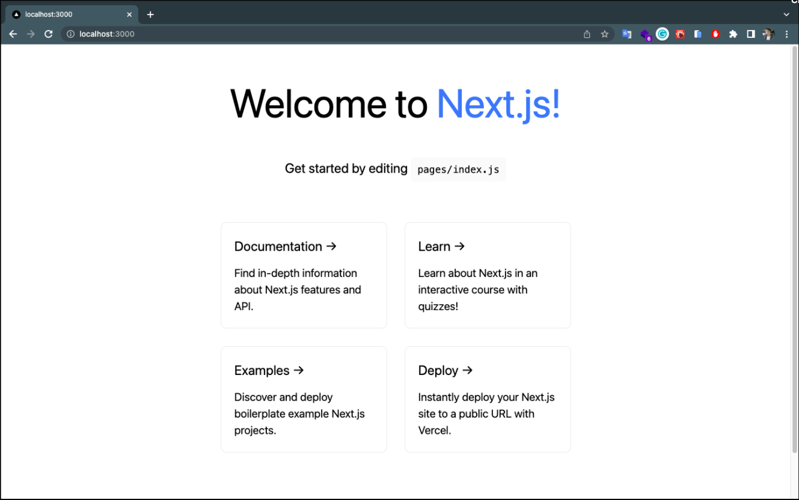

# Intro and Prepare

- Install NodeJs ⇒ [https://nodejs.org/en/](https://nodejs.org/en/)

- Setup NextJs project with “Create Next App” ⇒ [https://nextjs.org/docs](https://nextjs.org/docs)
- Install TailwindCss ⇒ [https://tailwindcss.com/docs/guides/create-react-app](https://tailwindcss.com/docs/guides/create-react-app)
- Install KontenBase SDK ⇒ [https://docs.kontenbase.com/overview/sdk](https://docs.kontenbase.com/overview/sdk)

