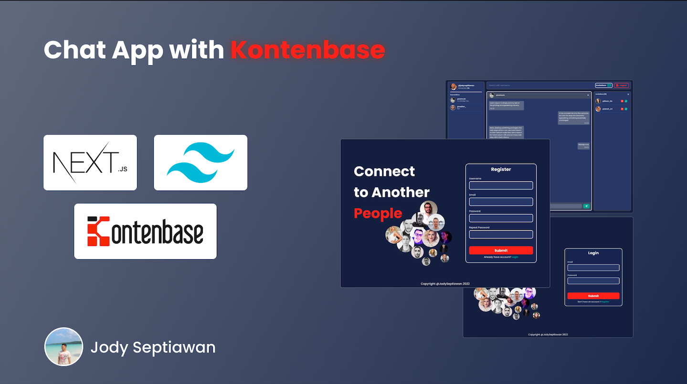

# Intro

Membuat Chat App sederhana, keren, dan simple menggunakan NextJs, TailwindCss, dan kontenbase sehingga kita tidak perlu coding back-end lagi.

MockUp: [Link](https://www.figma.com/file/7fUBmF9D9JZ7tcOg4DFmJ8/Chat-App-with-KontenBase?node-id=2%3A2)

# Prepare

- Install NodeJs ⇒ [https://nodejs.org/en/](https://nodejs.org/en/)

- Setup NextJs project with “Create Next App” ⇒ [https://nextjs.org/docs](https://nextjs.org/docs)
- Install TailwindCss ⇒ [https://tailwindcss.com/docs/guides/create-react-app](https://tailwindcss.com/docs/guides/create-react-app)
- Install KontenBase SDK ⇒ [https://docs.kontenbase.com/overview/sdk](https://docs.kontenbase.com/overview/sdk)

